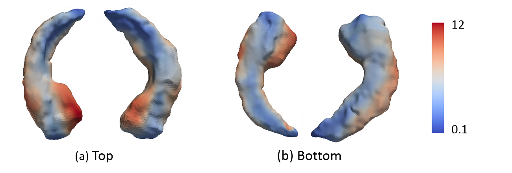
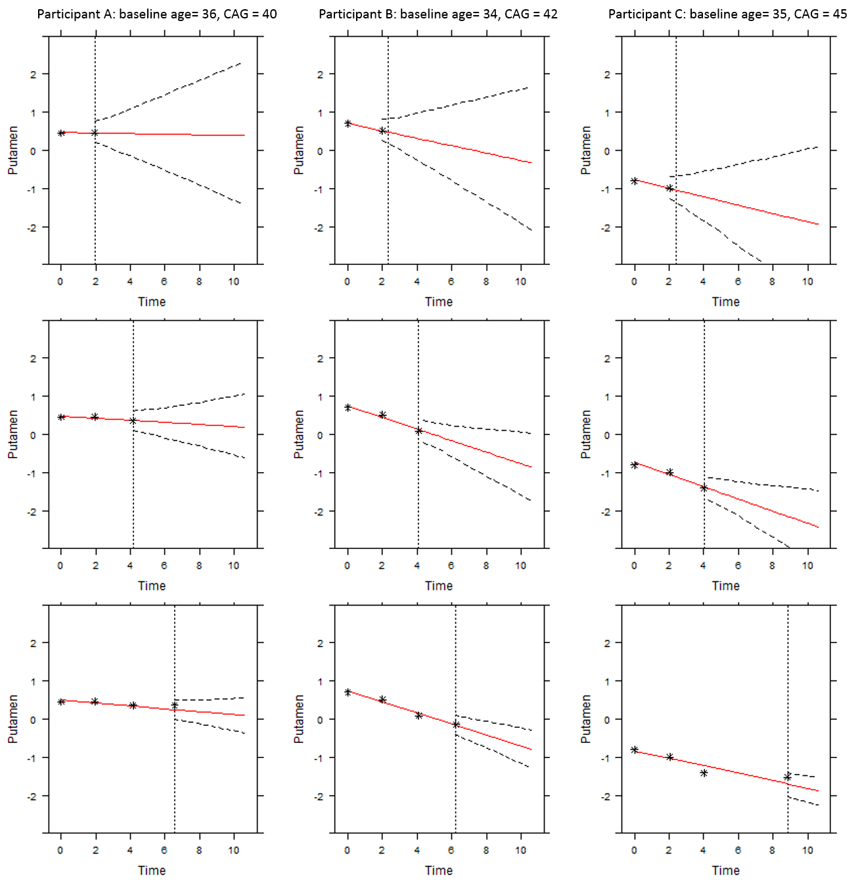
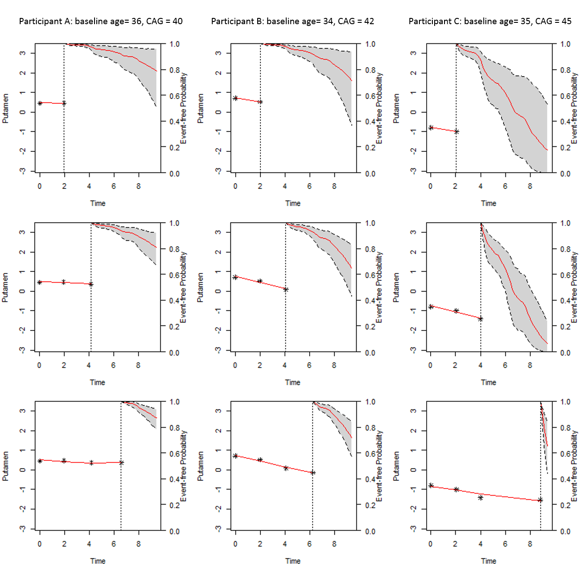
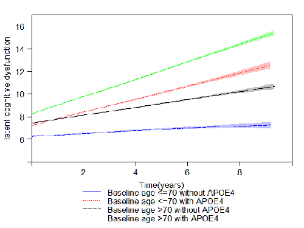
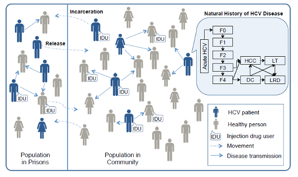
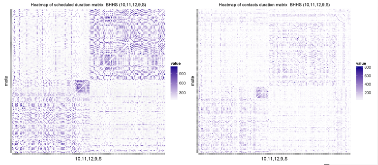
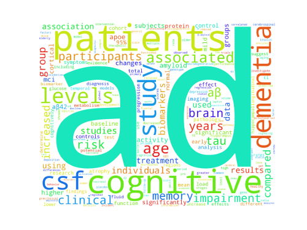
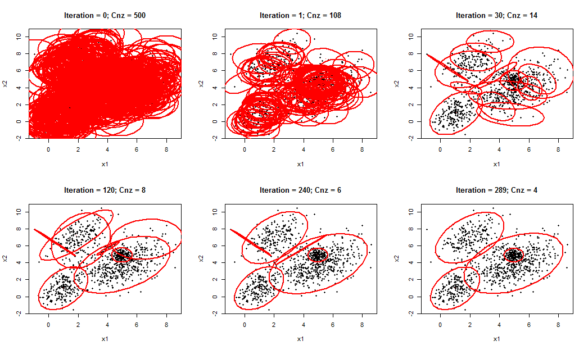

## Summary
- Too lazy to update anything here since had kids. 

---
[Benefit-Risk Assessment](#BRA) 
[Functional Data Analysis](#functional-data-analysis) 
[Dynamic Prediction](#dynamic-prediction) 
[Multivariate Longitudinal Outcomes](#multivariate-longitudinal-outcomes) 
[Agent Based Modeling](#agent-based-modeling) 
[Data Mining](#data-mining) 

Other interesting works:  
<a href="{{ site.url }}/2016/04/Beta-Regression/" target="_blank">Beta rectangular regression</a>, 
<a href="{{ site.url }}/2016/10/Parallelizing-MCMC/" target="_blank">Parallelizing MCMC</a>, 
<a href="https://github.com/kan-li/Rcpp-arms.git" target="_blank">Using Rcpp</a>

---
## Benefit-Risk Assessment
---

### Benefit-Risk Assessment  of Medical Products 
Benefit-risk (BR) assessment is essential to ensure the best decisions are made for a medical product in the clinical development process, regulatory marketing authorization, post-market surveillance, and coverage and reimbursement decisions. One challenge of BR assessment in practice is that the benefit and risk profile may keep evolving while new evidence is accumulating. Regulators and the International Conference on Harmonization (ICH) recommend performing periodic benefit-risk evaluation report (PBRER) through the product's lifecycle.  Moreover, Food and Drug Administration (FDA) launched the Patient Preference Initiative and emphasized the importance of patient engagement in product approval and patient-focused drug development. We developed a series of methods for benefit-risk assessment to address issues to support medical decision making.

---
## Functional Data Analysis
---

### Functional Joint Models for Longitudinal and Time-to-Event Data: An Application to Alzheimer's Disease <a href="files/Kan_FJM.pdf" target="_blank">[slides]</a> <a href="https://kanli.shinyapps.io/AD_prediction/" target="_blank">[Web App]</a>   
In the study of Alzheimer's disease (AD), researchers often collect repeated measurements of clinical variables, neurocognitive assessments (scalar outcomes), neuroimaging (functional outcome), genetic information, and event history to better understand the diseases. Given the lack of disease-modifying treatments for AD, an accurate prediction of the time to AD conversion based on this cumulative information is particularly helpful for physicians to monitor patients' disease progression and to plan timely interventions. We propose a series of novel functional joint models (FJM) to incorporate both scalar outcomes and functional outcomes in the framework of joint modeling of longitudinal and survival data. We first propose a functional joint model that accounts for time-invariant functional outcomes as predictors in both longitudinal and survival submodels in a joint model. In the second part of this work, we extend the model to account for time-variant functional outcome in a Bayesian multivariate joint modeling framework.  A dynamic prediction approach for predicting the patient's future scalar and functional outcomes, as well as the risk of AD conversion, is also developed. In the third part, we propose a novel framework for the use of multiple longitudinal scalar outcomes and longitudinal high-dimensional functional outcome (e.g., neuroimaging) to further improve the prediction of AD progression. We conduct extensive simulation studies to assess the performance of our proposed methods. The models are applied to the motivating Alzheimer's Disease Neuroimaging Initiative (ADNI) study, suggesting that incorporating the imaging markers as functional predictors into the model could improve the predictive ability of AD progression.

Hippocampus surface morphology data

 

---
## Dynamic Prediction
---

### Dynamic prediction of motor diagnosis in Huntington’s disease using a joint modeling approach <a href="https://kanli.shinyapps.io/HD_prediction/" target="_blank">[Web App]</a>  
Prediction of the diagnosis of Huntington’s disease (HD) can be improved by incorporating other phenotypic and biological clinical measures in addition to cytosine-adenine-guanine (CAG) repeat length and age. I constructed a mixed-effect model to describe the change of markers while jointly modeling the mixed-effects model with time-to-event data (HD diagnoses). The model was then used to build subject-specific prediction risk models. The time-dependent receiver operating characteristic (ROC) method were employed to assess the discriminating capability of the measures to identify high or low risk patients. The strongest predictor was used to illustrate the dynamic prediction of the event free probability and future health outcome for three hypothetical patients. The web-based calculator I developed could be an easily accessible tool for physicians to make prognostic predictions for premandifest patients and facilitate the medical decision-making process.

The dynamic prediction of future health outcome (left) and survival probability (right) for patients with low, medium and high risk of HD disease.

	<ul class="imgStyle"> 
	   	<li class="imgStyle"></li>
	    <li class="imgStyle"></li>
	</ul>

 

---
## Multivariate Longitudinal Outcomes
---

### Bayesian longitudinal item response theory model to estimate disease progression and treatment effects for Alzheimer'd diseae 
The item response theory (IRT) model is used to analysis multi-level questionnaire data. Traditionally, total score are used as a summary for these multi-item questionnaires. However, people with same total score may have quite different scores for each specific question. In clinical studies, especially for neurodegenerative disease, multivariate health outcomes are collected longitudinally to measure the development of a subject’s health status and treatment effects over time. IRT model provide a structure to describe the relationship between the observed multivariate outcomes and one or more continuous latent variables that represent disease status. I constructed a longitudinal item response model and applied it to Alzheimer's Disease Neuroimaging Initiative (ADNI) dataset to estimate disease progression and intervention effects. (Stan <a href="files/LIRT_ADNI.stan" target="_blank">code</a> of the unidimensional longitudinal IRT model for ADNI application)

Latent cognitive dysfunction of MCI patients over time

 

---
## Agent Based Modeling
---

### Treatment of Hepatitis C in Correctional Setting <a href="https://www.ncbi.nlm.nih.gov/pmc/articles/PMC4854298/" target="_blank">[Paper]</a> 
The prevalence of hepatitis C virus (HCV) in United States prisoners is high; however, HCV testing and treatment is rare. Infected inmates released back into society contribute to the spread of HCV in the general population. Routine hepatitis screening of inmates followed by treatment with new therapies offers hope to reduce ongoing HCV transmission. we developed the TapHCV (treatment as prevention of hepatitis C virus) model, an agent-based microsimulation model that predict the long-term benefits and costs of different HCV screening and treatment scenarios in US prisons. The model includes HCV disease transmission, the natural history of HCV based on parameterized Markov model, HCV screening in inmates, treatment of HCV infection with DAAs, and movement of people in and out of prisons. We simulated the disease and its progression both in prisons and in the general population to understand the complex dynamics between prison-related interventions and disease burden in society as a whole (Figure). The model was developed in the Java programming language.

 

### Social Mixing And Respiratory Transmission in Schools <a href="http://smart.pitt.edu/" target="_blank">(SMART)</a> 
A CDC founded project that attempts to quantify the contact pattern of school age children and study respiratory transmission in school settings. I developed an agent-based simulation models of infectious disease transmission and evaluated intervention strategies via simulation and statistical analysis <a href="http://www.smart.pitt.edu/archive/simudemo/bhhs.swf.html" target="_blank">(animation)</a>. 
I also parsed large data set to reconstruct social contact networks, conducted network analysis and parameterized simulation models. The figure blow display the heat map of contact duration matrix between students in a high school. The contact pattern predicted from  simulation model (left panel) is similar to the contact pattern constructed from real contact data (right panal).

 

---
## Data Mining
---

### Sparse Classification Methods for High Dimensional Data <a href="{{site.url }}/2016/08/Sparse-classification/" target="_blank">[Post]</a> 
The work aims to classify patient with Alzheimer’s Disease (AD) using gene expression data. Two methods were adopted to carry out classification: **sparse logistic regression** and **sparse proximal support vector machine**. I assessed how well the methods can discriminate between patients based on classification accuracy, sensitivity and specificity. A toy model is detailed in the post.

 

### Querying PubMed with python <a href="https://github.com/kan-li/SearchPubMed.git" target="_blank">[Git]</a> 
The objective of this project is searching PubMed data for a topic of interest and parse the retrieved information automatically.  The project is written in Python and served as a beta version of paper recommendation engine and literature review tool. This tool can fetch the searching results via PbuMed public API Entrez Database, summarize the results based on words frequency, conduct association rule mining on keywords sets using Apriori algorithm, make recommendation and provide results visualization. 

Word cloud generated from the searching results of Alzheimer’s Disease

 

### Clustering using robust **EM algorithm** in Multivariate Gaussian Mixture Models 
The purpose of this project is to implement expectation maximization (EM) algorithms to determine the structure of clustered data, with or without prior knowledge of the number of clusters. In practice, each cluster can be mathematically represented by a parametric distribution. The entire data set is therefore modeled by a mixture of these distributions.
For clustering, we need to address the issue of determining the number of clusters within the data as well.  Figueiredo and Jain proposed a robust EM to deal simultaneously with the number of clusters and also the estimate of parameters for mixture models by using the particular form of a minimum message length (MML) criterion. I improved Figueiredo-Jain Algorithm to ensures the algorithm converge faster and be more rousted. The proposed model is evaluated by simulation studies and is applied to the real data retrieved from the UCI Machine Learning Repository. 

Visualizeation of the iteration of fitting a Gaussian mixture using the proposed method in unsupervised study (with overlapping). 

 

